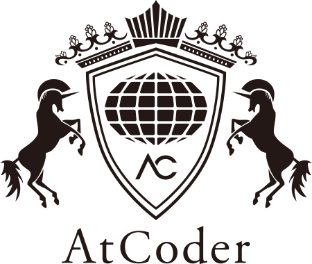

<!---
- 👋 Hi, I am Murad Ahmed Tahmim.
- 👀 I’m interested in programming.
- 🌱 I’m currently learning Flutter.
- 📫 How to reach me -> muradahmedtahmim@gmail.com.

--->
<!-- 
<h1 align="center">Hi 👋, I am Murad Ahmed Tahmim</h1><h3 align="center">Aspiring Mobile App Developer & Competitive Programmer</h3>

<!-- <h3 align="center">I love programming in every universe</h3> -->

  <h1>Murad Ahmed Tahmim</h1>
  
  <!-- Persistent Identity Badge -->
  
  
  <h3 align="center" >From Bangladesh | Turning Ideas into Mobile Apps</h3>

  <!-- Additional Persistent Badges -->
  

    
    <!--  -->
  

  
   
  
  <!-- Typing Animation -->
  

  <!--  -->
  
    
  
  <!-- Profile Views (Also persistent) -->
  

  

<h2 align="center">About Me</h2>

  I'm Murad, an aspiring app developer and competitive programmer with a strong passion for creating efficient and engaging digital experiences. 
  Currently learning <b>Flutter</b> and <b>Mobile app development</b>, I combine my problem-solving skills in <b>C++</b> to tackle complex challenges effectively. 
  I am always curious and eager to develop my skills, and I enjoy creating innovative projects that help me continuously improve my technical expertise and programming abilities.

<!-- 
 -->
<!-- 
  
 -->

- 📫 How to reach me **muradahmedtahmim@gmail.com**

<h3 align="center">Languages & Skills</h3>

     
  &nbsp;
  &nbsp;
  &nbsp;
  &nbsp;

     
  &nbsp;
  &nbsp;
    &nbsp;
  &nbsp;

<h3 align="center">Exploring..</h3>

     
  &nbsp;
  &nbsp;

<h3 align="center">Tools</h3>

  &nbsp;
  &nbsp;
  &nbsp; 
  &nbsp; 

 

<h3 align="center">Onlice judges:</h3>

<!--

  &nbsp;
  &nbsp;
  &nbsp;

-->

  &nbsp;&nbsp;
  &nbsp;&nbsp;
  &nbsp;&nbsp;

<h3 align="center">Connect with me:</h3>

<!-- &nbsp; -->
&nbsp;

&nbsp;

  
  

 

<!--          -->

  &nbsp;&nbsp;
  
  <!-- &nbsp;&nbsp;
   -->

<!-- 

  coming soon

 -->

